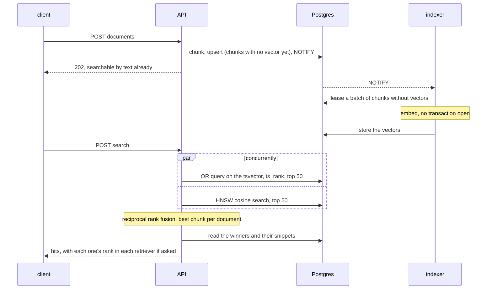

# fathom

[](https://github.com/tunahanaliozturk/fathom/actions/workflows/ci.yml)

Hybrid search on plain Postgres, with an evaluation harness that fails the build when relevance drops.

Documents go in over HTTP. Each is chunked on sentence boundaries and stored with a full-text index and, a few seconds
later, a vector from a small local model. A query runs both retrievers at once (an OR query over stemmed words, and an
HNSW nearest-neighbour search), fuses the two rankings by rank, keeps the best chunk per document, and returns
highlighted snippets. Everything lives in one Postgres database: no Elasticsearch, no vector store, nothing to keep in
sync.

What makes it more than a demo is that every ranking decision was measured, and is measured again on every push.

## Relevance

SQuAD 1.1 as a retrieval task: find the one paragraph that answers each question. Full method and every experiment in
[docs/evaluation.md](docs/evaluation.md).

| | lexical only | vector only | **hybrid** |
|---|---|---|---|
| nDCG@10, 400 questions over 2,067 passages (the CI gate) | 0.846 | 0.816 | **0.903** |
| nDCG@10, 2,000 questions over 10,067 passages | 0.768 | 0.766 | **0.851** |
| Recall@10, 2,000 questions over 10,067 passages | 0.877 | 0.902 | **0.954** |

Things the measurements decided, each in an ADR with its table:

- Postgres' own query parsers AND the words of a question together; fathom ORs them, because a question shares only
  some words with its answer. Ranking those OR queries with `ts_rank_cd` instead of `ts_rank` drops lexical nDCG from
  0.846 to 0.600 ([ADR 2](docs/adr/0002-or-queries-and-ts-rank.md)).
- Reciprocal rank fusion with k = 10 beats the usual k = 60 on both profiles
  ([ADR 3](docs/adr/0003-reciprocal-rank-fusion-in-the-application.md)).
- Sorting each embedding batch by length doubled indexing throughput
  ([ADR 6](docs/adr/0006-a-small-onnx-model-on-the-cpu.md)).

CI runs the CI profile with the real model on every push and fails if any mode's nDCG@10 falls more than 0.01 below
[eval/baseline.json](eval/baseline.json) ([ADR 4](docs/adr/0004-relevance-is-a-build-gate.md)). Switching the ranker
to `ts_rank_cd`, for instance, fails it:

```
REGRESSION lexical: nDCG@10 0.6003 is below the baseline 0.8462
REGRESSION hybrid: nDCG@10 0.8239 is below the baseline 0.9032
```

## Speed

On a laptop (Core Ultra 7 255H, Postgres in Docker Desktop), 11,122 chunks, 16 concurrent clients
([details](docs/benchmark-results/2026-10-04-laptop.md)):

| | searches/s | p50 | p99 |
|---|---|---|---|
| hybrid | 209 | 65 ms | 224 ms |
| vector only | 681 | 23 ms | 38 ms |
| lexical only | 353 | 37 ms | 144 ms |

Plus about 19 ms to embed the query. The model is the slow part of indexing: about 18 paragraphs a second per indexer
process on that laptop, which is why writes never wait for it.

## Quick start

Needs Docker. The image carries the model, so nothing is downloaded at run time.

```sh
docker compose up --build --wait
docker compose run --rm api keys create --collections '*' --scopes read,write --label laptop
```

The second command prints an API key, once. Paste it into [requests.http](requests.http) and work through it, or run
the same walk-through as a script:

```sh
uv run --no-project python tools/smoke.py fth_...
```

## How it works



- **One database** for documents, text index and vectors, so a delete or an update reaches both retrievers in the same
  transaction ([ADR 1](docs/adr/0001-both-retrievers-in-postgres.md)).
- **Writes never wait for the model.** Indexers lease work, embed with no transaction open, and write back only if the
  chunk is still the one they embedded. Rewriting a document re-embeds only the chunks whose text changed
  ([ADR 5](docs/adr/0005-embeddings-are-asynchronous.md)).
- **Keys** are scoped to collections and to read or write, stored as SHA-256 digests, compared in constant time; a key
  that cannot reach a collection gets 404, not 403 ([ADR 7](docs/adr/0007-scoped-api-keys.md)).

## What the tests hold it to

| promise | test |
|---|---|
| Hybrid relevance does not regress | the `relevance` CI job, against `eval/baseline.json` |
| A write does not wait for the model, and a vector computed for replaced text is never stored | `test_a_write_does_not_wait_for_the_model` |
| Editing one paragraph re-embeds one chunk; a document with repeated paragraphs can still be edited | `test_editing_one_paragraph_re_embeds_only_that_chunk`, `test_editing_a_document_with_two_identical_paragraphs_works` |
| Two indexers never embed the same chunk; a failed batch is retried | `test_two_indexers_share_the_backlog_and_embed_each_chunk_once`, `test_a_batch_whose_embedding_fails_stays_pending_for_the_next_attempt` |
| A key reaches only its collections and scopes; revoked keys stop working | `test_a_key_reaches_only_its_collections_and_scopes`, `test_a_revoked_key_stops_working` |
| A metadata filter applies inside both retrievers | `test_a_metadata_filter_applies_to_both_retrievers` |
| Chunks never exceed their budget and lose no words | `test_no_chunk_exceeds_the_budget_and_no_word_is_lost` (Hypothesis) |

Before the first release, a review set on breaking it found eleven problems; each fix came with one of the tests above.

## Running the checks

```sh
uv sync
uv run ruff check . && uv run ruff format --check .
uv run mypy src tests benchmarks
uv run lint-imports                      # chunking, fusion and the metrics may not touch the database or the model
uv run pytest tests                      # needs Docker: pgvector runs in a container
uv run python tools/license_audit.py     # every installed distribution must be permissively licensed
```

## Limitations

- English only (the `english` text search configuration and an English model).
- Postgres text ranking is not BM25 (ADR 2 measures what that costs here).
- Vectors lag writes by however long the indexers take; text search covers the gap.
- SQuAD questions share vocabulary with their answers, which flatters lexical search. The numbers compare versions of
  this system; they are not a claim about other data.

[docs/operations.md](docs/operations.md) has the configuration table, what to watch, and the runbooks.

## Licence

MIT for the code. The evaluation downloads SQuAD 1.1 (CC BY-SA 4.0) at run time and never stores it in the repository.
The default model, `BAAI/bge-small-en-v1.5`, is MIT. Every Python dependency, at every depth, is permissively licensed,
and CI checks it.
